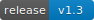
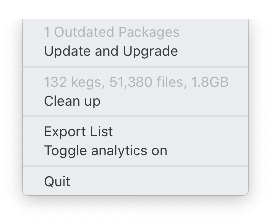

<h1>

Brewlet
</h1>

<a href="https://github.com/zkokaja/Brewlet/releases/tag/v1.1">
  
</a>

The missing menulet for [brew.sh].

This menulet makes it easier to use [brew.sh]. For example, you need to
manually check if some of your packages can be updated. With Brewlet it's easy:
if everything is working swimmingly, then you'll see the normal shadow 
 
icon. If updates are available to be installed, the icon will become colored,
 , to get your attention –
along with a notification if you wish.
Once clicked, you'll be able to upgrade your packages, among other options.
In addition, Brewlet will periodically check the status of packages in the
background, so you don't have to.




## Installation

Download the latest version from 
[releases](https://github.com/zkokaja/Brewlet/releases/latest)
or direct link
[here (zip)](https://github.com/zkokaja/Brewlet/releases/latest/download/Brewlet.zip).

## On the horizon

I am currently working on adding more features, listed in order of priority
here:

- Show list of outdated packages
- Ability to handle casks
- Add preferences window for time intervals
- Ability to install brew if not found
- Look for missing packages


## Developer

Contributions are welcome!

You can look for logged messages and errors with the Console app, or this command
(replacing with your PID of course):

```bash
$ log show --predicate 'processID == 6259' --info
```

To generate images of different sizes, use [Inkscape] on the command line:

```bash
$ len=64 # or use a for loop
$ inkscape --export-type="png" \
           --export-file brewlet-"$len".png \
           -w "$len" \
           brewlet.svg
```

## License & Acknowledgements

Because this app is closely tied to `brew.sh`, I used their icon as a template.
I also decided to adopt their choice of license: BSD 2-Clause "Simplified" License.

## Security & Permissions

Brewlet needs to be able to access the `brew.sh` shell script to get information 
and take action on your behalf. And access to write to your Downloads folder
when exportng a list of packages.

Brewlet needs permission to send you notifications when updates are available,
and when unexpected errors occur.

[brew.sh]: https://brew.sh
[Inkscape]: https://inkscape.org

