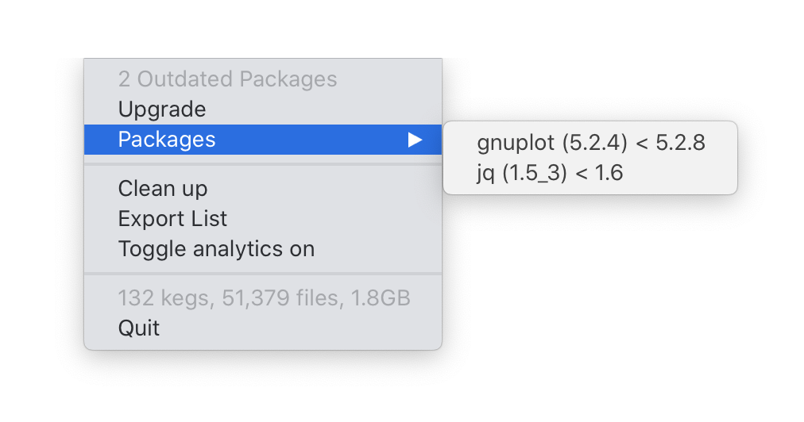

<h1>

Brewlet
</h1>

<a href="https://github.com/zkokaja/Brewlet/releases/latest">
  
</a>

The missing menulet for [brew.sh].

This menulet makes it easier to use [brew.sh]. For example, you need to
manually check if some of your packages can be updated. With Brewlet it's easy:
if everything is working swimmingly, then you'll see the normal shadow 
 
icon. If updates are available to be installed, the icon will become colored,
 , to get your attention –
along with a notification if you wish.
Once clicked, you'll be able to upgrade your packages, among other options.
In addition, Brewlet will periodically check the status of packages in the
background, so you don't have to.


When new versions are available, you can update all of them at once or manually
choose specific packages:



## Installation

Install with `brew` on the command line:
```bash
brew install brewlet
```

Or download the latest version from 
[releases](https://github.com/zkokaja/Brewlet/releases/latest)
or 
[here (zip)](https://github.com/zkokaja/Brewlet/releases/latest/download/Brewlet.zip).

You can upgrade to the latest version by running:
```bash
brew update
brew upgrade brewlet
```

## On the horizon

I am currently working on adding more features, listed in order of priority
here:

- Ability to handle casks
- Ability to install brew if not found
- About page with detailed information
- Features suggested by community (see Issues).

## Update vs Upgrade

The `update` operation pulls the latest version of Homebrew and updates 
the metadata related to packages. From the `man` pages:

> Fetch the newest version of Homebrew and all formulae from GitHub using git(1) and perform any necessary migrations.

Whereas `upgrade` will actually upgrade your outdated packages to the latest
version(s).

> Upgrade outdated, unpinned formulae using the same options they were originally installed with, plus any appended brew formula options.

## Developer

Contributions are welcome!

You can look for logged messages and errors with the Console app, 
or this command:

```bash
$ log show --predicate 'process == "Brewlet"' --info
$ log show --predicate "processID == `pgrep Brewlet`" --info --last 1h
```

To test for outdated packages, reinstall some older versions from a specific
commit. For example:

```bash
$ brew uninstall jq 
$ brew install https://raw.githubusercontent.com/Homebrew/homebrew-core/b76347c21bbe20accf0a514b138515e30a48ad12/Formula/jq.rb
```

To generate images of different sizes, use [Inkscape] on the command line:

```bash
$ len=64 # or use a for loop
$ inkscape --export-type="png" \
           --export-file brewlet-"$len".png \
           -w "$len" \
           brewlet.svg
```

Brew will redirect output of the `upgrade` command to a temporary file, you can
use this command to locate it.

```bash
$ find /var/folders -type f -name 'brewlet*log' 2> /dev/null
```

## License & Acknowledgements

Because this app is closely tied to `brew.sh`, I used their icon as a template.
I also decided to adopt their choice of license: BSD 2-Clause "Simplified" License.

## Security & Permissions

Brewlet needs to be able to access to:

- the `brew.sh` shell script to get information and take action on your behalf.
- access to write to your Downloads folder when exporting a list of packages.
- permissions to send you notifications when updates are available, and when unexpected errors occur.

[brew.sh]: https://brew.sh
[Inkscape]: https://inkscape.org

